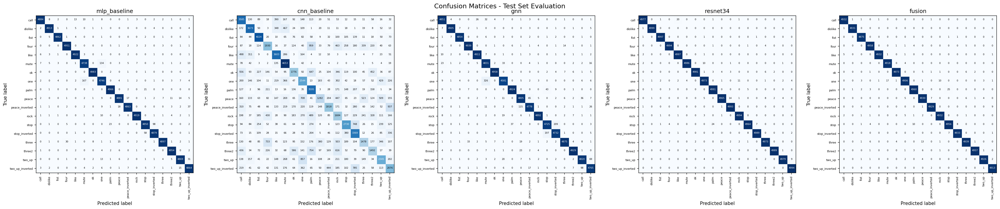

# Hand Gesture Classifier

A multimodal deep learning system for classifying 18 hand gestures using Graph Neural Networks, ResNet-34, and late fusion, achieving 99.72% accuracy on the HaGRID dataset.

---

## Demo



---

## Features

- **Multimodal Classification**: Combines RGB image features (ResNet-34) with hand landmark graph embeddings (GNN) via late fusion
- **Graph Neural Network**: 3-layer GCN operating on MediaPipe hand skeleton topology (21 nodes, 46 edges)
- **Transfer Learning**: ImageNet-pretrained ResNet-34 backbone with custom classifier head
- **Comprehensive Evaluation**: Accuracy, Macro F1, Precision, Recall, and confusion matrix visualization
- **Modular Architecture**: Clean separation of data loaders, model definitions, and training scripts
- **Reproducible Training**: Fixed random seeds, configurable hyperparameters, checkpoint saving

---

## Tech Stack

| Category | Technologies |
|----------|--------------|
| **ML Framework** | PyTorch, PyTorch Geometric |
| **Models** | MLP, CNN, GCN (GNN), ResNet-34, Late Fusion |
| **Data Processing** | NumPy, Pillow, torchvision |
| **Evaluation** | scikit-learn, Matplotlib |
| **Environment** | Python 3.10+, uv package manager |

---

## Installation

```bash
# Clone the repository
git clone https://github.com/quiet98k/hand-gestures-classifier.git
cd hand-gestures-classifier

# Install dependencies using uv (recommended)
uv sync
```

**Requirements:**
- Python >= 3.10
- CUDA-compatible GPU (recommended for training)

---

## Usage

### Training

Training notebooks are located in `training_scripts/`:

- `train_mlp_baseline.ipynb` - Landmark-based MLP
- `train_cnn_baseline.ipynb` - RGB image CNN
- `train_gnn.ipynb` - Graph Neural Network
- `train_resnet.ipynb` - ResNet-34 with transfer learning
- `train_fusion.ipynb` - Multimodal late fusion

### Evaluation

Use `test_models.ipynb` to evaluate all trained models on the test set. It generates accuracy, F1, precision, recall, and confusion matrices.

---

## Model and Training

### Dataset

**HaGRID (Hand Gesture Recognition Image Dataset)**
- ~548,000 images across 18 gesture classes
- Each sample includes RGB image crops and 21 MediaPipe hand landmarks
- Train/Val/Test splits provided

### Model Architectures

| Model | Input | Parameters | Test Accuracy |
|-------|-------|------------|---------------|
| MLP Baseline | 42-D landmarks | ~4K | 98.76% |
| CNN Baseline | 64x64 RGB | ~20K | 52.95% |
| GNN | 21-node graph | ~12K | 97.79% |
| ResNet-34 | 128x128 RGB | ~21M | 99.70% |
| **Fusion** | RGB + Graph | ~21.3M | **99.72%** |

### Training Configuration

| Model | Learning Rate | Batch Size | Epochs |
|-------|---------------|------------|--------|
| MLP / CNN / GNN | 1e-3 | 64-128 | 8 |
| ResNet-34 / Fusion | 1e-4 | 32 | 8 |

- **Optimizer**: Adam
- **Loss**: Cross-Entropy
- **Early Stopping**: Based on validation accuracy

---

## Project Structure

```
hand-gestures-classifier/
├── data/                    # Dataset (images, landmarks, crops)
├── data_loaders/            # PyTorch Dataset implementations
├── model_classes/           # Model architectures (MLP, CNN, GNN, ResNet, Fusion)
├── training_scripts/        # Jupyter notebooks for training
├── final_models/            # Saved model checkpoints (.pth)
├── graphs/                  # Training curves and confusion matrices
├── papers&reports/          # Final report and documentation
├── test_models.ipynb        # Evaluation notebook
├── create_cropped_dataset.py
└── pyproject.toml           # Dependencies
```

---

## License

MIT

---

## Acknowledgments

- [HaGRID Dataset](https://github.com/hukenovs/hagrid) by Kapitanov et al.