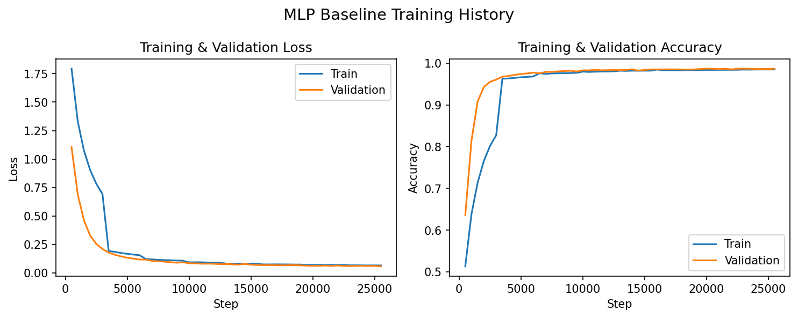
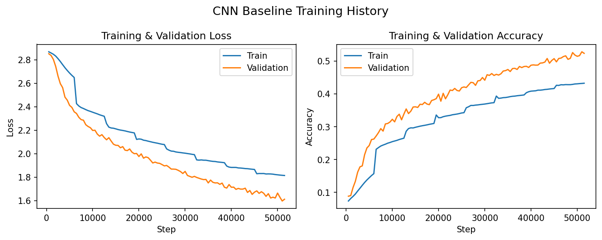
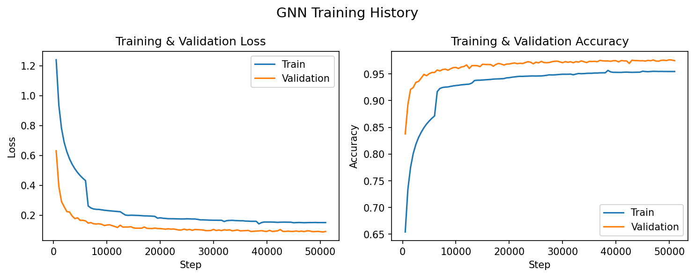
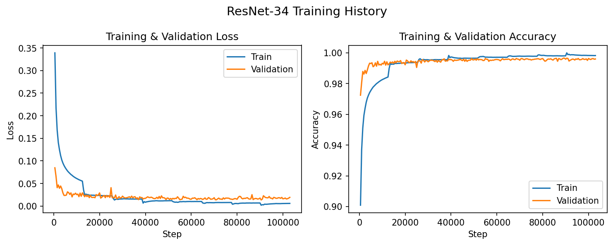
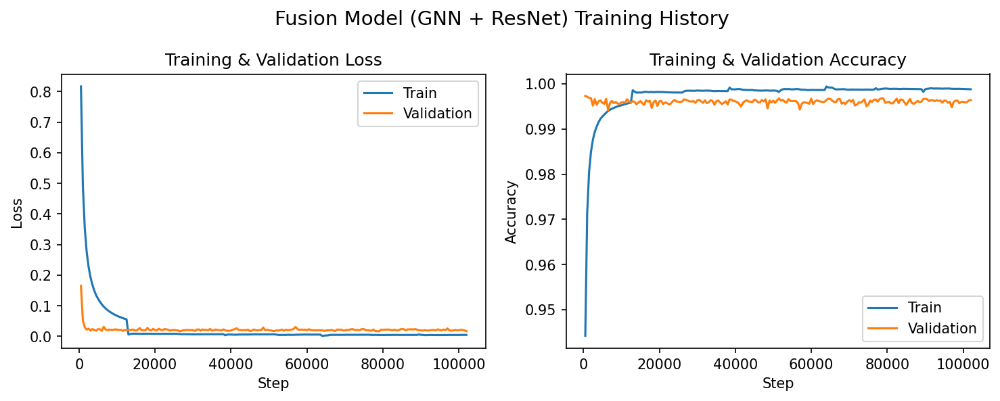

# Hand Gesture Classifier  

---

# 1. Literature Review  
The article I chose to review is *HaGRID — HAnd Gesture Recognition Image Dataset* by Kapitanov et al. (2024), the dataset and methodology on which this project is based. The paper introduces HaGRID, a large-scale hand-gesture image dataset designed for training gesture classification and dynamic gesture recognition systems. According to the abstract (page 1), the authors frame HaGRID as a resource for enabling robust gesture recognition on consumer devices, emphasizing the importance of a diverse and sufficiently large dataset for real-world performance. The dataset ultimately contains **approximately 548,000 images** covering **18 gesture classes**, including static gestures (e.g., “stop,” “peace,” “like”) and dynamic gestures represented as separate “start/end” frames (e.g., “swipe” sequences).

The paper’s main contribution is the **dataset creation pipeline**, shown in Figures 2–3 (pages 4–5). The pipeline involves (1) large-scale data collection through crowdsourcing, (2) multi-stage filtering by annotators, (3) bounding-box aggregation with consistency checks, and (4) final class annotation. The authors emphasize significant variability across subjects (age, clothing, pose), lighting conditions, backgrounds, and camera devices to improve generalization. Distribution plots on page 5 show variations in brightness, subject-to-camera distance, and resolution, supporting the authors’ claim that the dataset is intentionally heterogeneous to reflect real-world scenarios.

The paper also provides extensive **baseline results** (page 6), evaluating multiple CNN-based models (e.g., ResNet-18/34/50/152, MobileNetV3, EfficientNet) on the HaGRID classification task. Reported F1-scores for static gesture classification range from ~68% to ~91%, with larger backbones generally performing better. These results demonstrate that the task is nontrivial, especially under heterogeneous lighting and subject variation. The authors further analyze the influence of dataset characteristics—lighting diversity, background uniformity, and sample density—on performance (pages 7–8), concluding that diversity is essential for robust generalization.

This paper is directly relevant to the present project for three major reasons.

1. **Dataset Alignment**: The project uses HaGRID for both RGB and landmark-based gesture recognition; therefore, understanding its collection and annotation procedures is necessary to contextualize model performance.
2. **Baseline Comparisons**: The dataset paper’s CNN baselines provide a natural point of comparison for evaluating this project’s baseline CNN.
3. **Modality Relevance**: Although HaGRID itself contains images only, its high-quality bounding boxes facilitate landmark extraction (e.g., via MediaPipe Hands), enabling multimodal experimentation such as the MLP landmark model explored in this project.

Overall, the HaGRID paper offers valuable insight into dataset quality, diversity, and baseline expectations, all of which inform the challenges and outcomes of this project.

---

# 2. Baseline Experiment Design

The project establishes two modality-specific baseline models: an MLP classifier operating on MediaPipe landmark coordinates and a shallow CNN processing RGB image crops. These baselines serve to characterize the relative difficulty of the task for geometric (landmark-based) and appearance-based (image-based) modalities. Their design follows the principles outlined in the rubric, providing a clear and justifiable starting point for subsequent architectural improvements.

## 2.1 Dataset and Preprocessing

All experiments use the HaGRID dataset of 18 static hand gesture categories. Each sample includes:

- **RGB image crop** of the hand, extracted using dataset-provided bounding boxes  
- **21 MediaPipe keypoints**, each with 2D coordinates  

### Landmark Preprocessing
Landmarks are normalized relative to the bounding-box coordinates, ensuring translation/scaling invariance.  
Input forms:

- **MLP baseline:** flattened 42-dimensional vector  
- **GNN / fusion models:** structured 21×2 node-feature matrix  

### Image Preprocessing

- Crops resized to **64×64** (CNN baseline) or **128×128** (ResNet-34, fusion)  
- Pixel values normalized to [0, 1]  
- No augmentation applied (to maintain consistent conditions across models)

## 2.2 Baseline Models

### **MLP Baseline (Landmark Modality)**  
A lightweight two-layer perceptron acts as the geometric baseline:

- Input: 42 normalized landmark coordinates  
- Architecture: Linear(42→64) → ReLU → Linear(64→18)  
- No batch normalization or dropout  
- ~4K parameters  

This model quantifies how far simple geometric descriptors alone can separate gesture classes.

**Training History (Fig. 1)**  
*Figure 1. Training & validation loss and accuracy for the MLP baseline.*  

---

### **CNN Baseline (RGB Modality)**  
A shallow CNN provides a minimal appearance-based baseline:

- Conv(3→32, 3×3) → ReLU  
- Conv(32→64, 3×3) → ReLU  
- MaxPool(2×2)  
- AdaptiveAvgPool → Dropout(0.1) → Linear(64→18)  
- ~20K parameters  

This model intentionally underfits the dataset’s complexity, establishing a lower bound for RGB-based performance.

**Training History (Fig. 2)**  
*Figure 2. Training & validation loss and accuracy for the CNN baseline.*  

---

## 2.3 Baseline Evaluation Metrics

All baselines (and final models) are evaluated using:

- **Top-1 Accuracy**  
- **Macro Precision**  
- **Macro Recall**  
- **Macro F1-Score**  

Macro metrics are essential due to slight class imbalance and the need to weight all gesture categories uniformly.

**Confusion Matrices (Fig. 3)**  
*Figure 3. Confusion matrices for MLP and CNN baselines.*  

---

## 2.4 Baseline Results Summary

| Model          | Top-1 Accuracy | Macro F1 | Macro Precision | Macro Recall |
|----------------|----------------|----------|-----------------|--------------|
| MLP Baseline   | 0.9876         | 0.9876   | 0.9876          | 0.9876       |
| CNN Baseline   | 0.5295         | 0.5160   | 0.5257          | 0.5295       |

These results indicate:

- Landmark geometry is **highly informative**, even with a simple MLP.  
- RGB appearance requires **substantially more capacity** than a shallow CNN to achieve competitive accuracy.

This motivates the exploration of graph neural networks (to better utilize geometric structure) and deeper pretrained CNNs (to extract richer visual features), both of which form the core of the final experimental design.

---

# 3. Statement of the Main Problem

Hand gesture recognition requires jointly understanding hand geometry, articulation, and visual appearance under real-world variability. Although RGB-based CNNs and landmark-based pose models each capture different aspects of this problem, their comparative strengths and potential complementarity remain insufficiently explored.

This motivates the central research question:

**Can structured landmark representations (via GNNs), pretrained deep image encoders (via ResNet-34), and multimodal late fusion improve gesture classification accuracy beyond simple single-modality baselines?**

The associated hypothesis is:

> **A GNN will outperform simple MLP landmark baselines; a pretrained ResNet-34 will outperform shallow CNN baselines; and multimodal fusion will yield the highest performance overall.**

---

# 4. Experiment Design

The experiment is designed to compare models across three dimensions:
1. **Geometric modeling**: MLP baseline vs. GNN  
2. **Appearance modeling**: CNN baseline vs. ResNet-34  
3. **Modality integration**: individual models vs. late fusion  

All models are trained on identical train/validation splits, using the same optimizer, batch sizes scaled to model complexity, and early stopping for fairness.

## 4.1 Dataset and Preprocessing

- HaGRID dataset (18 classes)  
- Landmark normalization using bounding-box coordinates  
- RGB normalization to [0,1]  
- Uniform preprocessing across models, without augmentation  

## 4.2 Evaluation Outputs
Each model outputs:

- Training & validation loss curves  
- Training & validation accuracy curves  
- Confusion matrix (combined into one consolidated figure for all models)  
- Accuracy, Macro Precision, Recall, F1  

## 4.3 Model Comparison Strategy

- **MLP vs. GNN** → Tests structural modeling of landmarks  
- **CNN vs. ResNet-34** → Tests benefits of transfer learning  
- **Fusion model** → Tests complementary information across modalities  

---

# 5. Methodology

This section summarizes the architecture and rationale for each model.

## 5.1 Data Processing

- **Landmarks:** 21×2 keypoints normalized to bounding-box coordinates  
- **Images:** resized to 64×64 (baseline CNN) or 128×128 (ResNet34/Fusion)  
- **Graphs:** MediaPipe skeletal edges → 21 nodes, 48 directed edges  

## 5.2 Model Architectures

### MLP Baseline

- Linear(42→64) → ReLU → Linear(64→18)  
- ~4K parameters  

### CNN Baseline

- 2× Conv → ReLU → MaxPool  
- AdaptiveAvgPool → Dropout(0.1) → Linear  
- ~20K parameters  

### GNN

- 3× GCNConv(→64) + BatchNorm + ReLU  
- Global mean pooling → MLP classifier  
- ~12K parameters  

### ResNet-34

- ImageNet pretrained backbone  
- Dropout(0.2) + Linear(512→18) head  
- ~21M parameters  

### Fusion Model

- Concatenation of:  
  - GNN embedding (64-D)  
  - ResNet embedding (512-D)  
- Classifier: 576→256→128→18  
- BatchNorm + Dropout(0.3)  

## 5.3 Training Settings

| Model        | LR     | Batch | Dropout | Epochs | Image Size |
|--------------|--------|--------|---------|--------|------------|
| MLP          | 1e-3   | 128    | 0.0     | 8      | N/A        |
| CNN Baseline | 1e-3   | 64     | 0.1     | 8      | 64×64      |
| GNN          | 1e-3   | 64     | 0.1     | 8      | N/A        |
| ResNet-34    | 1e-4   | 32     | 0.2     | 8      | 128×128    |
| Fusion       | 1e-4   | 32     | 0.3     | 8      | 128×128    |

---

# 6. Results and Analysis

## 6.1 Summary of Quantitative Results

| Model        | Top-1 Acc | Macro F1 | Macro Precision | Macro Recall |
|--------------|-----------|-----------|------------------|--------------|
| MLP Baseline | 0.9876    | 0.9876    | 0.9876           | 0.9876       |
| CNN Baseline | 0.5295    | 0.5160    | 0.5257           | 0.5295       |
| GNN          | 0.9779    | 0.9779    | 0.9781           | 0.9779       |
| ResNet-34    | 0.9970    | 0.9970    | 0.9970           | 0.9970       |
| Fusion       | 0.9972    | 0.9972    | 0.9972           | 0.9972       |

## 6.2 Landmark Models: MLP vs. GNN

**Observations:**

- MLP displays extremely strong performance → landmark geometry highly discriminative.  
- GNN slightly underperforms MLP, likely because structural relationships add little when landmarks already encode strong class separability.

## 6.3 Image Models: CNN Baseline vs. ResNet-34

**CNN baseline** underfits due to limited depth and lack of pretrained filters.  
**ResNet-34** achieves near-perfect accuracy, demonstrating the power of transfer learning.

## 6.4 Fusion Model

Fusion marginally surpasses ResNet-34:

- Corrects scattered errors that ResNet occasionally makes  
- Benefits from geometric cues for fine articulation distinctions  

## 6.5 Training Curves (Final Models)

*GNN Training Curves:*  

*ResNet-34 Training Curves:*  

*Fusion Training Curves:*  

**Confusion Matrix (All Models):**  

## 6.6 Interpretation

1. **Landmarks alone nearly solve the task**, even with shallow models.  
2. **RGB modality requires deep pretrained CNNs** to achieve competitive accuracy.  
3. **Fusion yields the best performance**, though gains are small—suggesting diminishing returns when ResNet already classifies almost perfectly.

---

# 7. Conclusion

This project demonstrated that:

- Simple MLPs are strong baseline performers for hand-landmark classification.  
- GNNs do not significantly outperform them on static gestures with clean landmarks.  
- Pretrained ResNet-34 networks achieve state-of-the-art single-modality performance.  
- Multimodal late fusion produces the highest overall accuracy (99.72%).  

**Future Work:**

- Incorporating data augmentation for robustness  
- Temporal modeling (LSTMs, Transformers) for dynamic gestures  
- Exploring mid-fusion and attention-based cross-modal integration  

---